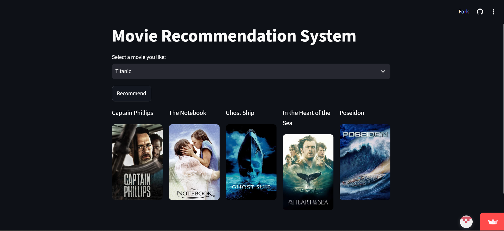

# 🎬 CineMind — Movie Recommendation System

Ever wondered how Netflix always seems to know what you'd want to watch next? This is my attempt at building that — a movie recommendation system that looks at a film you like and finds others that feel similar, based on genre, cast, director, and plot.

**🔗 Try it live:** [cinemind-movie-recommender.streamlit.app](https://cinemind-movie-recommender.streamlit.app)




---

## What this actually does

Pick a movie you like, hit "Recommend," and CineMind gives you 5 movies that share something meaningful with it — not just the same genre, but a real blend of genre, lead cast, director, and plot themes.

I built this using **content-based filtering**. Instead of relying on what thousands of other users rated (which needs a ton of user data I don't have), it looks purely at what a movie *is* — its own metadata — and finds others that look similar in that same space. Under the hood, that means turning each movie's info into a set of numbers and measuring how "close" those numbers are using something called cosine similarity.

---

## How it's put together

```
Raw data → Clean it up → Build a "profile" per movie → Turn it into numbers → Measure similarity → Show recommendations
```

A bit more detail, if you're curious:

1. **Started with the TMDB 5000 dataset** — two CSVs, one with movie details, one with cast/crew, which I merged together.
2. **Cleaned everything up** — the genre, cast, and crew columns came in as messy JSON-like strings, so I had to parse those into something actually usable.
3. **Built a combined "tags" profile** for each movie — genre + top 3 actors + director + plot overview, all squashed into one text field.
4. **Converted that text into numbers** using CountVectorizer — basically counting which words show up in each movie's profile.
5. **Computed similarity** between movies using cosine similarity, done on the fly for whichever movie you pick (more on why below).
6. **Wrapped it all in a Streamlit app**, with real poster images pulled from the TMDB API.

---

## Built with

- **Python** — the whole thing, obviously
- **Pandas / NumPy** — for wrangling the data
- **scikit-learn** — CountVectorizer + cosine similarity
- **Streamlit** — turned this from notebook code into an actual usable app
- **TMDB API** — for fetching poster images
- **Google Colab** for building the model, **VS Code** for the app itself

---

## About the dataset

I used the [TMDB 5000 Movie Dataset](https://www.kaggle.com/datasets/tmdb/tmdb-movie-metadata) from Kaggle — about 4800 movies with genre, cast, crew, keywords, and plot info.

One honest limitation: this dataset is almost entirely English-language/Hollywood movies, since it's built from TMDB's most-popular-at-the-time snapshot. No Bollywood or regional cinema in there currently — something I'm planning to add by pulling in more movies directly through the TMDB API.

---

## Want to run it yourself?

```bash
git clone https://github.com/Nandini200506/cineMind-movie-recommender.git
cd cineMind-movie-recommender

python -m venv venv
venv\Scripts\activate      # Windows
source venv/bin/activate   # Mac/Linux

pip install -r requirements.txt
```

You'll also need your own free TMDB API key (grab one at [themoviedb.org](https://www.themoviedb.org/settings/api)). Once you have it, create a file at `.streamlit/secrets.toml` with:

```toml
TMDB_API_KEY = "your_api_key_here"
```

Then just run:

```bash
streamlit run app.py
```

---

## What's inside

```
cineMind/
├── app.py                  # the actual Streamlit app
├── movies.pkl              # cleaned movie data
├── vectors.pkl             # vectorized movie features
├── requirements.txt        # what to install
├── .streamlit/
│   └── secrets.toml         # your API key lives here (kept out of git)
└── .gitignore
```

---

## What I'd like to add next

- Bollywood and regional Indian cinema — the dataset's biggest gap right now
- A hybrid approach, blending in collaborative filtering if I can find a good ratings dataset
- Swapping CountVectorizer for TF-IDF or embeddings, for smarter similarity matching
- Basic user accounts, so recommendations could adapt to someone's actual watch history over time

---

## About me

**Nandini Prajapati**
B.Tech Final Year Student

Built this as a way to actually learn the full ML pipeline end-to-end — not just the modeling part, but the messy data-cleaning bits and getting something real, deployed, and usable out the other end.
